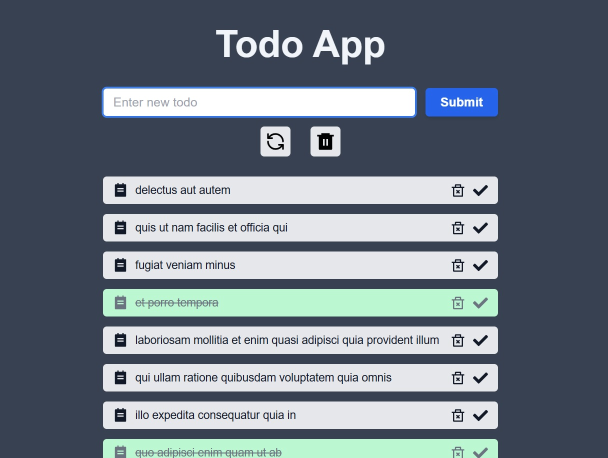

# ToDo App

## Description

This is a TODO web application built using HTML, CSS, Tailwind CSS, React, TypeScript, Next.js and Git. It allows you to add, delete and mark tasks as completed. The interface has a minimalistic style, ensuring ease of use. Thanks to Next.js, the application is fast and optimized, while Tailwind CSS provides adaptive layout. The code is managed with Git, making version control and deployment easy.

## Technologies that have been used

- HTML5
- CSS3
- TAILWIND
- TYPESCRIPT
- REACT
- NEXT JS
- GIT

## Instructions for working with the project

1. Cloning a repository. You need to write `git clone https://github.com/boikoua/test_todo` in terminal.

2. Go to the project folder `cd test_todo`.

3. Check the node version. The version of node should be `v20.x.x`. To do this, type the command `node -v` in the terminal.

4. Install dependencies. To do this, enter the `npm install` command.

5. Run the project. To do this, enter the `npm run dev` command.
   After that the project will be available to you at `http://http://localhost:3000/`.

## View project

> Link to the project
> [DEMO LINK]().

## Preview

